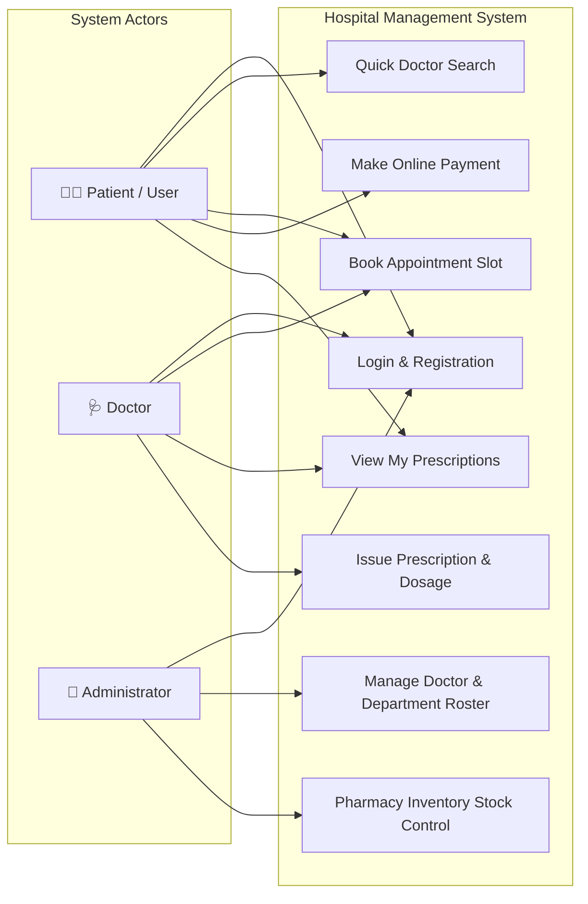
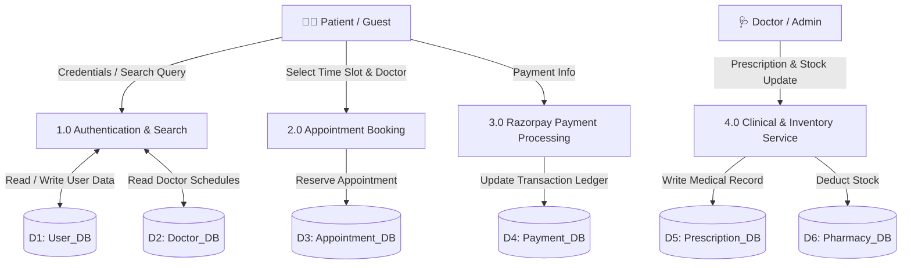
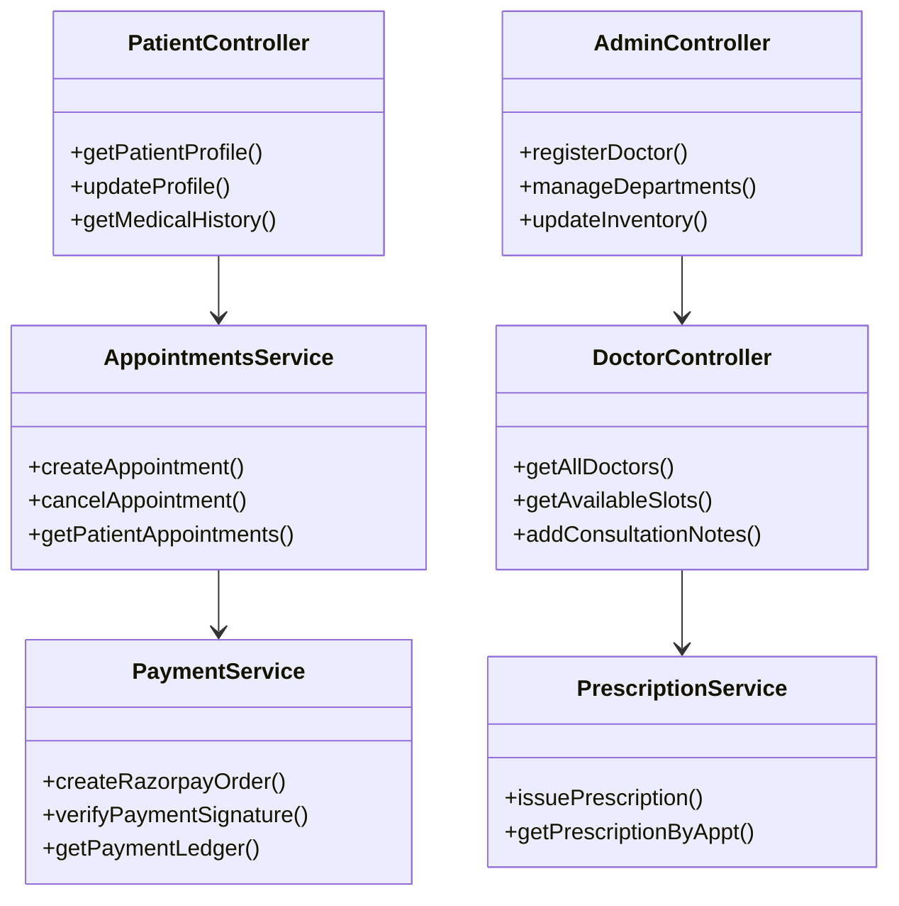

<h1 align="center">🏥 Hospital Management System (HMS)</h1>

<p align="center">
  <b>A modern healthcare platform designed for streamlined patient care, doctor scheduling, and hospital administration.</b>
</p>

<p align="center">
  <a href="https://medicare-hospital.duckdns.org">
    
  </a>
  
  
  
  
  
</p>

<p align="center">
  <a href="https://medicare-hospital.duckdns.org"><b>🚀 Launch Live Application</b></a>
  &nbsp;&nbsp;•&nbsp;&nbsp;
  <a href="#-interactive-documentation-center"><b>📖 Documentation Hub</b></a>
  &nbsp;&nbsp;•&nbsp;&nbsp;
  <a href="#-quick-start-guide"><b>⚡ Quick Start</b></a>
</p>

---

## 👋 Welcome to HMS

The **Hospital Management System (HMS)** is an intuitive, web-based platform built to eliminate administrative friction in healthcare facilities. It brings patients, medical practitioners, and hospital administrators into a single, cohesive digital portal.

Whether it's a patient searching for a specialist, a doctor updating digital consultation records, or an administrator tracking pharmacy stock, HMS makes the experience fast, transparent, and hassle-free.

### 🌟 Core Capabilities
- ⏱️ **Real-Time 30-Min Slot Booking**: Prevents schedule conflicts between 09:00 AM and 05:00 PM.
- 💳 **Online Payment Processing**: Seamless Razorpay gateway integration with signature verification and email receipts.
- 📋 **Digital Prescriptions**: Linked directly to patient consultation history and medical logs.
- 💊 **Integrated Pharmacy Control**: Automatic inventory updates tied directly to prescribed medications.
- 🔍 **Instant Doctor Search**: Public guest discovery by department, specialization, room number, or fee without registration.

---

## 📖 Interactive Documentation Center

Click on any section below to explore the detailed technical specifications, architecture diagrams, and system designs:

<details>
<summary><b>📁 1. Project Repository Structure</b></summary>

HMS follows a clean monorepo architecture separating the Spring Boot 3.x backend service and the React 18 SPA frontend:

```
Hospital-Management-System/
├── Back-hospital-management-system/          # Spring Boot 3.x REST API Backend
│   ├── src/main/java/com/hospital/hospital_management_system/
│   │   ├── RestController/                    # REST Controller Endpoints
│   │   ├── service/                           # Core Business Services & Integrations
│   │   ├── model/                             # Hibernate Entity Models (10 Core Tables)
│   │   ├── repository/                        # Spring Data JPA Repositories
│   │   ├── DTO/                               # Data Transfer Objects
│   │   ├── config/                            # Security, CORS, & Mail Configurations
│   │   ├── filter/                            # JWT Security Filters
│   │   ├── utils/                             # Utility & Helper Classes
│   │   └── Exceptions/                        # Global Exception Handlers
│   ├── Dockerfile                             # Backend Docker Configuration
│   └── pom.xml                                # Maven Dependencies & Build Configuration
│
├── Front-hospital-management-system/          # React 18 SPA Frontend
│   └── hospital managment system/
│       ├── src/
│       │   ├── admin/                         # Admin Dashboard & Roster Management Views
│       │   ├── doctor/                        # Doctor Portal & Prescription Issuance Views
│       │   ├── patient/                       # Patient Portal, Doctor Search & Booking Views
│       │   ├── components/                    # Reusable UI Components & Modals
│       │   ├── config/                        # Axios Interceptors & Endpoint Routes
│       │   ├── utils/                         # Token Management & Helpers
│       │   ├── App.jsx                        # Main Application Gateway
│       │   └── main.jsx                       # React DOM Entrypoint
│       ├── Dockerfile                             # Frontend Docker Configuration
│       ├── nginx.conf                         # Nginx Reverse Proxy Config
│       └── package.json                       # Dependencies & Scripts
│
├── docker-compose.yml                         # Container Orchestration
├── .env                                       # Environment Configuration
└── README.md                                  # Documentation
```
</details>

<details>
<summary><b>👥 2. User Roles & Workflow Capabilities</b></summary>

```
                  ┌──────────────────────────────────────────────┐
                  │          Hospital Management System          │
                  └──────┬─────────────────┬──────────────┬──────┘
                         │                 │              │
           ┌─────────────┴─────┐    ┌──────┴───────┐   ┌──┴──────────┐
           │   Patient / User  │    │    Doctor    │   │ Admin User  │
           └─────────────┬─────┘    └──────┬───────┘   └──┬──────────┘
                         │                 │              │
     • Quick Doctor Search                 │              │
     • 30-Min Slot Booking                 │              │
     • Razorpay Online Payment             │              │
     • View Prescriptions & History ───────┼──────────────┤
     • Profile & Password Reset            │              │
                                   • Manage Availability  │
                                   • Issue Prescriptions  │
                                   • Review Patient List  │
                                                          • Doctor Onboarding
                                                          • Department Config
                                                          • Pharmacy Stock
                                                          • System Analytics
```
</details>

<details>
<summary><b>📐 3. System Architecture & Flow Diagrams</b></summary>

### Use Case Diagram


---

### Level-1 Data Flow Diagram (DFD)


---

### Service Layer Architecture

</details>

<details>
<summary><b>🗄️ 4. Relational Database Schema (10 Core Tables)</b></summary>

### 1. `users` — Account Identity Store
| Column | Data Type | Constraints | Description |
| :--- | :--- | :--- | :--- |
| `userid` | BigInt(20) | PK, Auto Increment | Account ID |
| `email` | Varchar(255) | Unique, Not Null | Login email address |
| `password` | Varchar(255) | Not Null | BCrypt hashed password |
| `firstName` | Varchar(30) | Nullable | First name |
| `lastName` | Varchar(30) | Nullable | Last name |
| `contactdetails` | Varchar(10) | Not Null | 10-digit mobile number |
| `address` | Varchar(255) | Nullable | Residential address |
| `profile_photo` | Varchar(255) | Nullable | Profile photo URL |
| `date_of_birth` | Date | Not Null | Date of birth |
| `timeofcreation` | Timestamp | Not Null | Account creation time |
| `UserRole` | Varchar(50) | Enum | `PATIENT`, `DOCTOR`, `ADMIN` |

### 2. `patients` — Patient Profile Details
| Column | Data Type | Constraints | Description |
| :--- | :--- | :--- | :--- |
| `patient_id` | BigInt(20) | PK, Auto Increment | Patient ID |
| `user_id` | BigInt(20) | FK ➔ `users(userid)` | Linked user account |
| `blood_group` | Varchar(10) | Nullable | Blood group |
| `emergency_contact_name` | Varchar(50) | Nullable | Emergency contact name |
| `emergency_contact_number` | Varchar(15) | Nullable | Emergency contact phone |
| `emergency_contact_relation` | Varchar(20) | Nullable | Contact relationship |
| `description` | Varchar(255) | Nullable | Patient background notes |

### 3. `doctor` — Medical Practitioner Directory
| Column | Data Type | Constraints | Description |
| :--- | :--- | :--- | :--- |
| `doctorid` | BigInt(20) | PK, Auto Increment | Doctor ID |
| `user_id` | BigInt(20) | FK ➔ `users(userid)` | Linked user account |
| `department_id` | BigInt(20) | FK ➔ `department(departmentId)` | Assigned department |
| `specialization` | Varchar(255) | Not Null | Medical specialty |
| `qualification` | Varchar(255) | Not Null | Degrees (e.g., MBBS, MD) |
| `yearsOfExperience` | Int(11) | Not Null | Years of practice |
| `consultationFee` | Double(10,2) | Not Null | Consultation charge |
| `licenseNumber` | Varchar(255) | Unique, Not Null | Medical license number |
| `roomNumber` | Int(11) | Nullable | Consultation room number |
| `availabilityStatus` | Varchar(50) | Enum | `AVAILABLE`, `NOT_AVAILABLE`, `ON_LEAVE` |
| `description` | Varchar(1000) | Nullable | Doctor biography |

### 4. `department` — Clinical Departments
| Column | Data Type | Constraints | Description |
| :--- | :--- | :--- | :--- |
| `departmentId` | BigInt(20) | PK, Auto Increment | Department ID |
| `departmentName` | Varchar(255) | Unique, Not Null | Department name |
| `description` | Varchar(500) | Nullable | Department overview |

### 5. `appointments` — Consultation Ledger
| Column | Data Type | Constraints | Description |
| :--- | :--- | :--- | :--- |
| `appointment_id` | BigInt(20) | PK, Auto Increment | Appointment ID |
| `patient_id` | BigInt(20) | FK ➔ `patients` | Patient ID |
| `doctor_id` | BigInt(20) | FK ➔ `doctor` | Doctor ID |
| `department_id` | BigInt(20) | FK ➔ `department` | Department ID |
| `appointment_date` | Date | Not Null | Date of consultation |
| `appointment_start_time` | Time | Not Null | Slot start time |
| `appointment_end_time` | Time | Not Null | Slot end time |
| `appointmentType` | Varchar(50) | Enum | Consultation type |
| `status` | Varchar(50) | Enum | `PENDING`, `CONFIRMED`, `CANCELLED`, `COMPLETED` |
| `remarks` | Varchar(500) | Nullable | Notes |

### 6. `payments` — Transaction Audit Log
| Column | Data Type | Constraints | Description |
| :--- | :--- | :--- | :--- |
| `payment_id` | BigInt(20) | PK, Auto Increment | Payment ID |
| `appointment_id` | BigInt(20) | FK ➔ `appointments` | Booking ID |
| `patient_id` | BigInt(20) | FK ➔ `patients` | Patient ID |
| `doctor_id` | BigInt(20) | FK ➔ `doctor` | Doctor ID |
| `razorpay_order_id` | Varchar(100) | Unique, Not Null | Razorpay order ID |
| `razorpay_payment_id` | Varchar(255) | Unique, Nullable | Gateway payment ID |
| `razorpay_signature` | Varchar(500) | Nullable | HMAC SHA-256 signature |
| `receipt_number` | Varchar(255) | Unique, Not Null | Receipt reference |
| `amount` | Decimal(10,2) | Not Null | Transaction amount |
| `currency` | Varchar(10) | Not Null | Currency code |
| `payment_method` | Varchar(50) | Enum | Payment mode |
| `order_status` | Varchar(50) | Enum | Order processing state |
| `payment_status` | Varchar(50) | Enum | `PENDING`, `SUCCESS`, `FAILED` |
| `paid_at` | Timestamp | Nullable | Payment confirmation timestamp |
| `created_at` | Timestamp | Nullable | Order creation timestamp |

### 7. `medicine_master` — Pharmacy Inventory
| Column | Data Type | Constraints | Description |
| :--- | :--- | :--- | :--- |
| `medicine_id` | BigInt(20) | PK, Auto Increment | Medicine ID |
| `medicine_name` | Varchar(100) | Not Null | Medicine name |
| `generic_name` | Varchar(100) | Nullable | Active ingredient |
| `manufacturer` | Varchar(100) | Nullable | Manufacturer |
| `strength` | Varchar(50) | Nullable | Dosage strength |
| `dosage_form` | Varchar(50) | Nullable | Tablet, Syrup, etc. |
| `is_active` | Boolean | Not Null | Stock active status |

### 8. `prescription` — Diagnostic Headers
| Column | Data Type | Constraints | Description |
| :--- | :--- | :--- | :--- |
| `prescription_id` | BigInt(20) | PK, Auto Increment | Prescription ID |
| `appointment_id` | BigInt(20) | FK ➔ `appointments` | Appointment reference |
| `diagnosis` | Varchar(500) | Not Null | Diagnosis summary |
| `notes` | Varchar(1000) | Nullable | Doctor advice |
| `createdAt` | Timestamp | Nullable | Issuance timestamp |

### 9. `prescription_medicine` — Prescribed Medications
| Column | Data Type | Constraints | Description |
| :--- | :--- | :--- | :--- |
| `prescription_medicine_id` | BigInt(20) | PK, Auto Increment | Line item ID |
| `prescription_id` | BigInt(20) | FK ➔ `prescription` | Prescription ID |
| `medicine_id` | BigInt(20) | FK ➔ `medicine_master` | Medicine ID |
| `dosage` | Varchar(50) | Not Null | Unit dosage |
| `frequency` | Varchar(50) | Not Null | Intake frequency |
| `duration` | Varchar(50) | Not Null | Intake duration |
| `instructions` | Varchar(300) | Nullable | Special instructions |
| `quantity` | Varchar(30) | Nullable | Dispensed quantity |

### 10. `password_reset_token` — Security Tokens
| Column | Data Type | Constraints | Description |
| :--- | :--- | :--- | :--- |
| `id` | BigInt(20) | PK, Auto Increment | Token entry ID |
| `token` | Varchar(255) | Unique, Not Null | Secure UUID token |
| `user_id` | BigInt(20) | FK ➔ `users` | Linked user ID |
| `expiryTime` | Timestamp | Not Null | Expiration timestamp |
| `used` | Boolean | Not Null | Token used status |
</details>

<details>
<summary><b>💻 5. Code Standards & Naming Conventions</b></summary>

| Identifier Category | Casing Pattern | Example Implementation | Context & Rules |
| :--- | :--- | :--- | :--- |
| **Classes & Enums** | `PascalCase` | `Patient`, `DoctorService`, `AppointmentController` | Noun phrases representing domain concepts. No underscores. |
| **Service Methods** | `camelCase` | `getPatientById()`, `bookAppointment()`, `processPayment()` | Action-oriented verbs describing specific business operations. |
| **Method Parameters** | `camelCase` | `patientId`, `doctorDTO`, `appointmentDate` | Self-explanatory parameter names reflecting types and roles. |
| **Interfaces** | `PascalCase` | `PatientRepository`, `PaymentService` | Contracts for Spring Data JPA repositories and core services. |
| **Entity Properties** | `PascalCase` / `camelCase` | `ConsultationFee`, `appointmentDate` | Noun attributes mapped to database columns. |
| **Private Fields** | `_camelCase` | `_patientService`, `_doctorRepo` | Private dependency fields injected into service layers. |
| **Exceptions** | `PascalCase` + `Exception` | `ResourceNotFoundException`, `UnauthorizedAccessException` | Suffix mandatory for all custom exception handlers. |
</details>

<details>
<summary><b>🗓️ 6. Development Milestones & History</b></summary>

```
2026-04-12  ──  Project Kickoff & Requirements Planning
2026-04-25  ──  SRS Documentation & Scope Finalization
2026-06-10  ──  System Architecture & 10-Table Database Design Approval
2026-07-02  ──  Backend Core Infrastructure Setup (Spring Boot 3.x + MySQL 8.0)
2026-07-08  ──  JWT Authentication & User Account REST APIs
2026-07-14  ──  Doctor Discovery & 30-Minute Slot Scheduling Logic
2026-07-20  ──  React 18 Single Page Application Frontend
2026-07-26  ──  Admin Control Panel & Department Roster Management
2026-07-30  ──  Razorpay Payment Gateway & Transaction Email Receipts
2026-08-02  ──  Pharmacy Inventory Stock & Digital Prescription Module
2026-08-05  ──  Security Audit & Role-Based Access Control Checks
2026-08-07  ──  Pilot Trial & Staff Workflow Optimization
2026-08-09  ──  Query Index Optimization & Performance Tuning
2026-08-11  ──  Production Build Compilation & AWS Cloud Deployment
```
</details>

---

## 🛠️ Technology Stack

- **Frontend**: React 18 SPA (Vite), Vanilla CSS, Axios, Lucide React, Tabler Icons
- **Backend**: Java 21, Spring Boot 3.x, Spring Security (JWT), Spring Data JPA, Hibernate ORM
- **Database**: MySQL 8.0 / Amazon RDS
- **Integrations**: Razorpay Payment API Gateway, JavaMailSender (SMTP)
- **DevOps & Infrastructure**: Docker, Docker Compose, Nginx Reverse Proxy, AWS EC2, Let's Encrypt SSL, DuckDNS

---

## ⚡ Quick Start Guide

### Prerequisites
- [Java 17/21 JDK](https://www.oracle.com/java/technologies/downloads/)
- [Node.js 18+ and npm](https://nodejs.org/)
- [MySQL 8.0](https://dev.mysql.com/downloads/installer/)
- [Docker Desktop](https://www.docker.com/products/docker-desktop/) *(Optional)*

---

### Step 1: Clone Repository
```bash
git clone https://github.com/utkarshpawade1234/Hospital-Management-System.git
cd Hospital-Management-System
```

---

### Step 2: Set Environment Variables
Create a `.env` file in the root folder:

```env
# Database Configuration
DB_URL=jdbc:mysql://localhost:3306/hospital_management_system
DB_USERNAME=root
DB_PASSWORD=your_mysql_password

# Security & CORS
JWT_SECRET=your_super_secret_jwt_key_32_bytes_long!!
FRONTEND_URL=http://localhost:5173

# Email Service (SMTP)
MAIL_HOST=smtp.gmail.com
MAIL_PORT=587
MAIL_USERNAME=your-email@gmail.com
MAIL_PASSWORD=your-app-password

# Payment Gateway (Razorpay)
RAZORPAY_KEY_ID=your_razorpay_key_id
RAZORPAY_KEY_SECRET=your_razorpay_key_secret
```

---

### Step 3: Run with Docker (Recommended)
```bash
docker compose up -d --build
```
Access the application at `http://localhost`.

---

### Step 4: Run Manually

#### Launch Backend (Spring Boot):
```bash
./mvnw clean install
./mvnw spring-boot:run
```
*(Backend runs on `http://localhost:8080`)*

#### Launch Frontend (React SPA):
```bash
cd Front-hospital-management-system/"hospital managment system"
npm install
npm run dev
```
*(Frontend runs on `http://localhost:5173`)*

---

## 📄 License

Distributed under the MIT License. See `LICENSE` for details.
