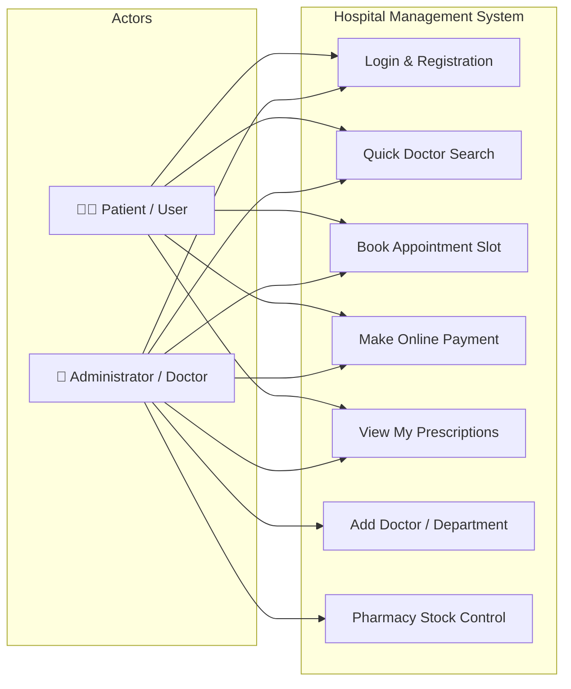
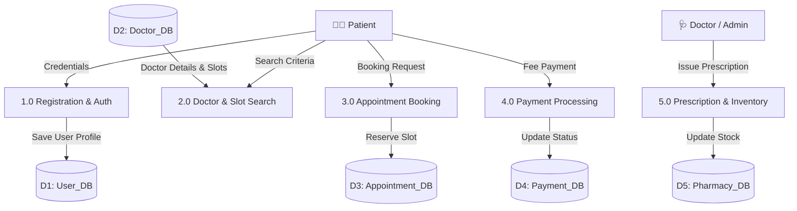
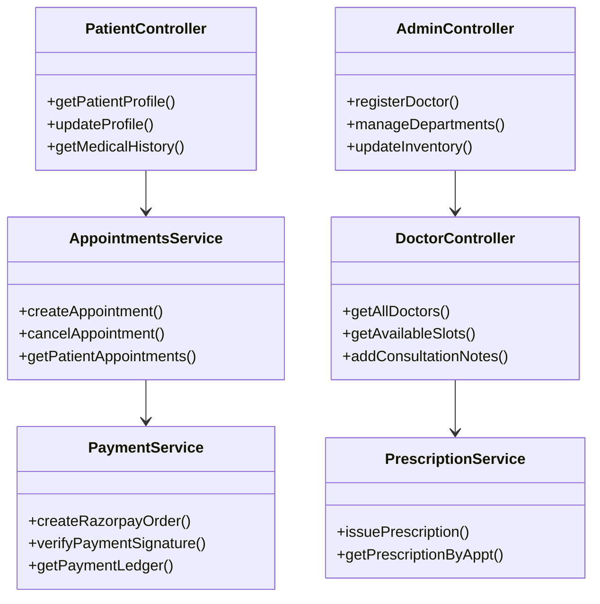

<h1 align="center">🏥 Hospital Management System (HMS)</h1>

<p align="center">
  <b>A Web-Based Healthcare Management Platform</b><br />
  <i>Developed for Post Graduate Diploma in Advanced Computing (PG-DAC) at Sunbeam Institute of Information Technology, Pune.</i>
</p>

<p align="center">
  <a href="https://medicare-hospital.duckdns.org">
    
  </a>
  <a href="USER_CREDENTIALS.md">
    
  </a>
  
  
  
  
  
</p>

<p align="center">
  <a href="https://medicare-hospital.duckdns.org"><b>🚀 Open Live Application</b></a>
  &nbsp;&nbsp;•&nbsp;&nbsp;
  <a href="USER_CREDENTIALS.md"><b>🔐 View All Test User Credentials</b></a>
</p>

---

## 📌 Project Overview

This **Hospital Management System (HMS)** is a full-stack web application designed to simplify hospital operations and patient care. It replaces traditional paperwork with an online workflow for doctor discovery, appointment slot booking in 30-minute intervals, Razorpay payment verification, digital prescriptions, and pharmacy stock management.

The system caters to three main types of users:
- **Patients**: Browse doctors across specialties, pick preferred time slots, pay online, view digital prescriptions, and track medical history.
- **Doctors**: Update consultation availability, review appointment bookings, and write digital prescriptions with custom dosage and instructions.
- **Administrators**: Register new doctors, manage departments, monitor patient rosters, oversee pharmacy stock, and track hospital analytics.

---

## 🔑 Quick Demo Credentials

Try the live site at **[medicare-hospital.duckdns.org](https://medicare-hospital.duckdns.org)** using any of these test accounts:

| User Role | Email / Username | Password | Credentials Guide |
| :--- | :--- | :--- | :--- |
| **Admin** | `admin@hospital.com` | `admin123` | [🔐 Full Credentials List](USER_CREDENTIALS.md) |
| **Doctor (Newly Created by Admin)** | *(Email assigned by Admin)* | **`1234`** | [🔐 Full Credentials List](USER_CREDENTIALS.md) |
| **Doctor (Pre-seeded Demo)** | `amit.patel@hospital.com` | `doctor123` | [🔐 Full Credentials List](USER_CREDENTIALS.md) |
| **Patient** | `aarav.sharma@gmail.com` | `patient123` | [🔐 Full Credentials List](USER_CREDENTIALS.md) |

---

## 🌟 Core System Modules

### 🔍 1. Doctor Discovery & Quick Search
- Search doctors by **Department Name**, **Doctor Name**, or **Specialization** without needing an account.
- Displays doctor qualification, experience, room numbers, consultation fee, and real-time status (`AVAILABLE`, `NOT_AVAILABLE`, `ON_LEAVE`).

### 📅 2. Appointment Booking (30-Minute Slots)
- Book consultation time slots in **30-minute intervals** between **09:00 AM and 05:00 PM**.
- Slot conflict checking ensures no two patients can book the same slot for the same doctor.
- Appointments are ordered by date and ID, showing recent bookings at the top.

### 💳 3. Razorpay Payment Gateway Integration
- Secure payment processing via Razorpay REST API order creation and HMAC signature verification.
- Automatically transitions appointment status from `PENDING` to `CONFIRMED` upon payment success.
- Sends instant email confirmation receipts via JavaMailSender.

### 💊 4. Digital Prescriptions & Pharmacy Stock Control
- Doctors issue digital prescriptions attached to individual appointment IDs.
- Tracks diagnosis, clinical notes, and specific medicine details (dosage, frequency, duration, instructions, quantity).
- Centralized `medicine_master` keeps stock counts updated.

### 🔐 5. Security & Access Control
- JWT-based authentication with role permissions (`PATIENT`, `DOCTOR`, `ADMIN`).
- Password hashing using `BCryptPasswordEncoder`.
- Explicit CORS whitelisting (`setAllowedOrigins`) in `SecurityConfig.java` to protect backend endpoints.

---

## 📐 System Diagrams & Architecture

### 1. Use Case Diagram



---

### 2. Level-1 Data Flow Diagram (DFD)



---

### 3. System Class Diagram Architecture



---

## 🗄️ Database Schema (10 Relational Tables)

The system uses MySQL 8.0 hosted on Amazon RDS:

```
├── users (userid, email, password, firstName, lastName, contactdetails, address, date_of_birth, userRole)
├── patients (patient_id, user_id, blood_group, emergency_contact_name, emergency_contact_number, relation)
├── doctor (doctorid, user_id, department_id, specialization, qualification, yearsOfExperience, consultationFee, roomNumber, availabilityStatus)
├── department (departmentId, departmentName, description)
├── appointments (appointment_id, patient_id, doctor_id, department_id, appointment_date, start_time, end_time, status)
├── payments (payment_id, appointment_id, patient_id, doctor_id, razorpay_order_id, razorpay_payment_id, amount, payment_status)
├── medicine_master (medicine_id, medicine_name, generic_name, manufacturer, strength, dosage_form, is_active)
├── prescription (prescription_id, appointment_id, diagnosis, notes, createdAt)
├── prescription_medicine (prescription_medicine_id, prescription_id, medicine_id, dosage, frequency, duration, instructions)
└── password_reset_token (id, token, user_id, expiryTime, used)
```

---

## 💻 Coding Standards & Conventions

| Identifier Type | Casing Standard | Example | Additional Notes |
| :--- | :--- | :--- | :--- |
| **Class** | PascalCase | `Patient`, `DoctorService`, `AppointmentController` | Noun phrase representing domain objects |
| **Method** | camelCase | `getPatientById()`, `bookAppointment()`, `processPayment()` | Verb phrases describing actions |
| **Parameter** | camelCase | `patientId`, `doctorDTO`, `appointmentDate` | Descriptive name matching parameter domain |
| **Interface** | PascalCase | `PatientRepository`, `PaymentService` | Spring Data JPA interfaces & service contracts |
| **Property** | PascalCase | `ConsultationFee`, `AppointmentStatus` | Model entity attributes |
| **Private Field** | `_camelCase` | `_patientService`, `_doctorRepo` | Private injected dependencies |
| **Exception** | PascalCase + `Exception` | `ResourceNotFoundException`, `PatientNotFoundException` | Custom exception classes |

---

## 🧪 Testing & Verification Summary

| Test Case | Expected Result | Status | Notes |
| :--- | :--- | :--- | :--- |
| **User Registration** | Redirects to login / patient dashboard | ✅ Passed | Creates valid `users` & `patients` record |
| **User Login** | Issues JWT token, loads dashboard | ✅ Passed | Authenticates with `BCryptPasswordEncoder` |
| **Password Reset** | Email reset link sent via SMTP | ✅ Passed | Token expires after 15 minutes |
| **Quick Doctor Search** | Displays matching doctors and open slots | ✅ Passed | Filterable by Department / Doctor name |
| **Slot Reservation** | Validates availability, saves booking | ✅ Passed | Blocks overlapping 30-min time slots |
| **Payment Gateway** | Generates Razorpay Order ID | ✅ Passed | HMAC SHA-256 signature verification |
| **Payment Confirmation** | Status updated to `CONFIRMED` | ✅ Passed | Sends confirmation email receipt |
| **Digital Prescriptions** | Saves diagnosis, dosage, and instructions | ✅ Passed | Linked directly to `appointment_id` |

---

## 🗓️ Project Lifecycle & Development Timeline

```
APR 12, 2026 ── Project Allotment & Initial Requirements Gathering (Feasibility Study)
APR 25, 2026 ── SRS Document Draft & Stakeholder Validation (Requirement Analysis)
JUN 10, 2026 ── System Architecture & Relational Database Design Approval (Design Phase)
JUL 02, 2026 ── Backend Setup with Spring Boot 3 & MySQL (Setup Phase)
JUL 08, 2026 ── Authentication & User Management APIs (Coding Phase)
JUL 14, 2026 ── Doctor Discovery & Slot Booking REST Endpoints (Coding Phase)
JUL 20, 2026 ── React 18 SPA Frontend Development (Coding Phase)
JUL 26, 2026 ── Admin Control Panel & Roster Management (Coding Phase)
JUL 30, 2026 ── Razorpay Payment Gateway & Email Service Integration (Coding Phase)
AUG 02, 2026 ── Pharmacy Stock & Digital Prescription Module (Coding Phase)
AUG 05, 2026 ── Integration Testing & RBAC Security Audit (Testing Phase)
AUG 07, 2026 ── User Acceptance Testing (UAT) with Hospital Staff (Testing Phase)
AUG 09, 2026 ── Bug Fixes, UI Polish & Performance Tuning (Debugging Phase)
AUG 11, 2026 ── Final Project Submission & AWS Cloud Server Deployment (Deployment Phase)
```

---

## 🛠️ Technology Stack

- **Frontend**: React 18, Vite, Vanilla CSS, Axios, Lucide Icons, Tabler Icons
- **Backend**: Java 21, Spring Boot 3, Spring Security (JWT), Spring Data JPA, Hibernate ORM
- **Database**: MySQL 8.0 / Amazon RDS
- **Integrations**: Razorpay Payment API, JavaMailSender (SMTP)
- **DevOps & Cloud**: Docker, Docker Compose, Nginx Reverse Proxy, AWS EC2, Let's Encrypt SSL (Certbot), DuckDNS

---

## 🚀 Running Locally

### 1. Clone the Repository
```bash
git clone https://github.com/utkarshpawade1234/Hospital-Management-System.git
cd Hospital-Management-System
```

### 2. Configure Environment Variables
Create a `.env` file in the root folder:
```env
DB_URL=jdbc:mysql://localhost:3306/hospital_management_system
DB_USERNAME=root
DB_PASSWORD=yourpassword
FRONTEND_URL=http://localhost:5173
MAIL_USERNAME=your-email@gmail.com
MAIL_PASSWORD=your-app-password
RAZORPAY_KEY_ID=your_razorpay_key
RAZORPAY_KEY_SECRET=your_razorpay_secret
```

### 3. Launch with Docker Compose
```bash
docker compose up -d --build
```
Access the application at `http://localhost`.

---

## 🎓 Academic Credit & Acknowledgements

This project was built as part of the **Post Graduate Diploma in Advanced Computing (PG-DAC)** program at **Sunbeam Institute of Information Technology (SIIT), Pune**.

- **Author**: Utkarsh Pawade (0225 PG-DAC)
- **Faculty Guide**: Prof. Neeti Chandrakar
- **Course Coordinators**: Mr. Nitin Kudale, Mr. Yogesh Kolhe
