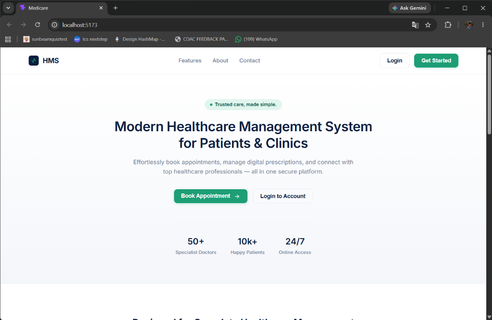
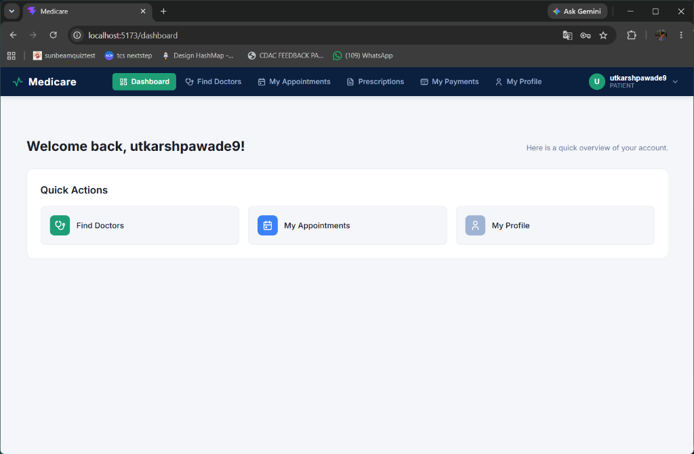
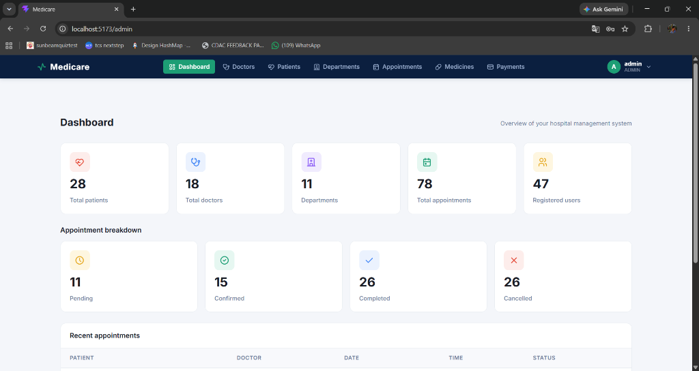
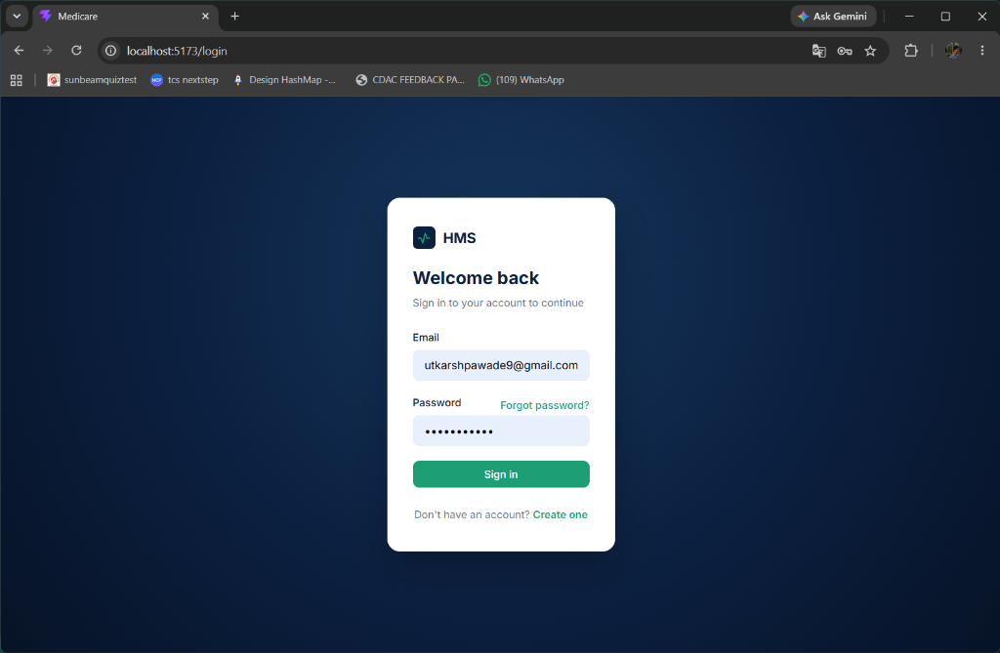
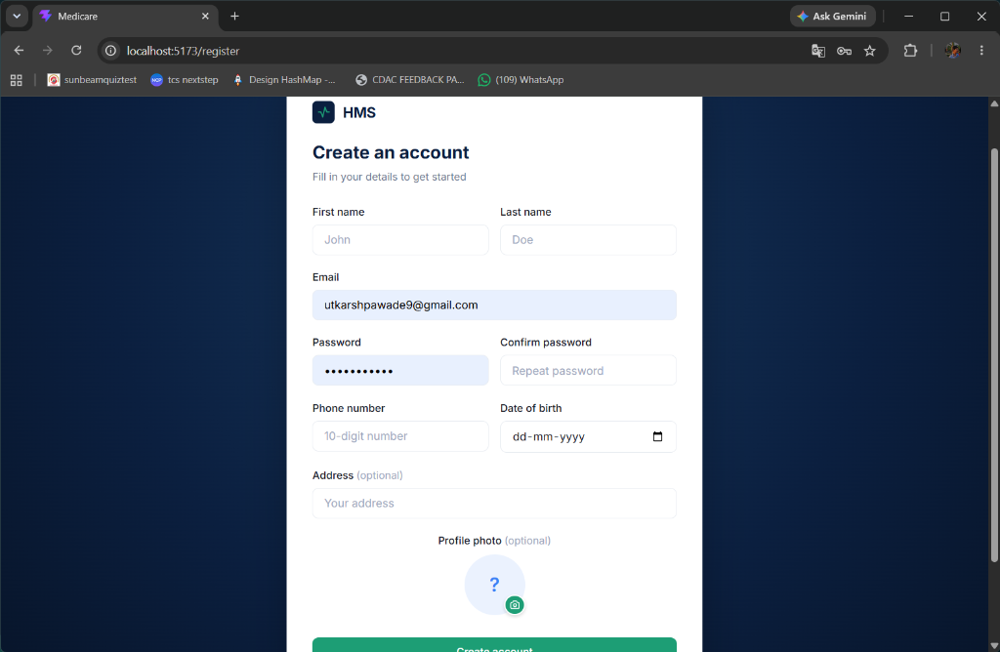
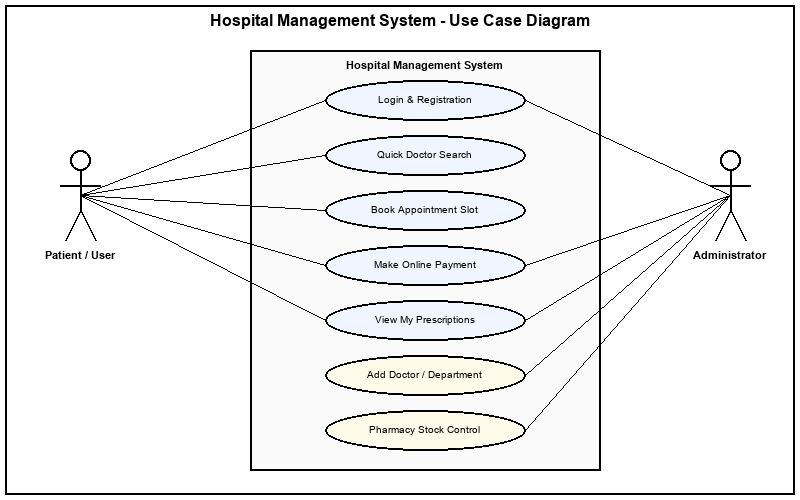
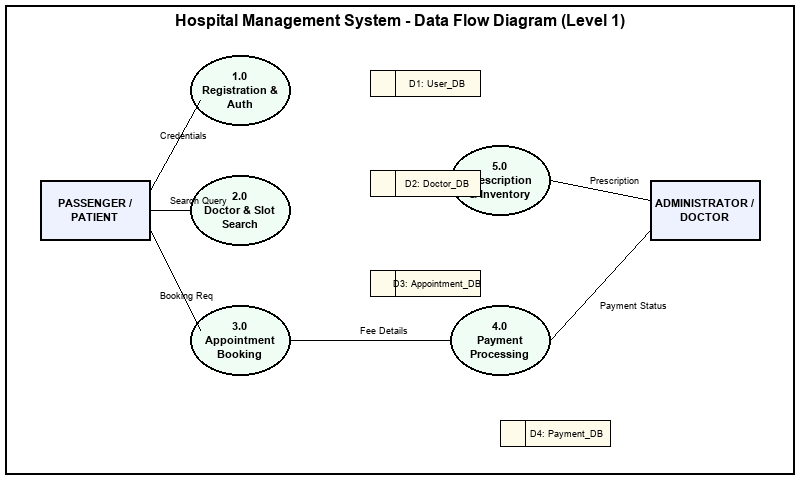
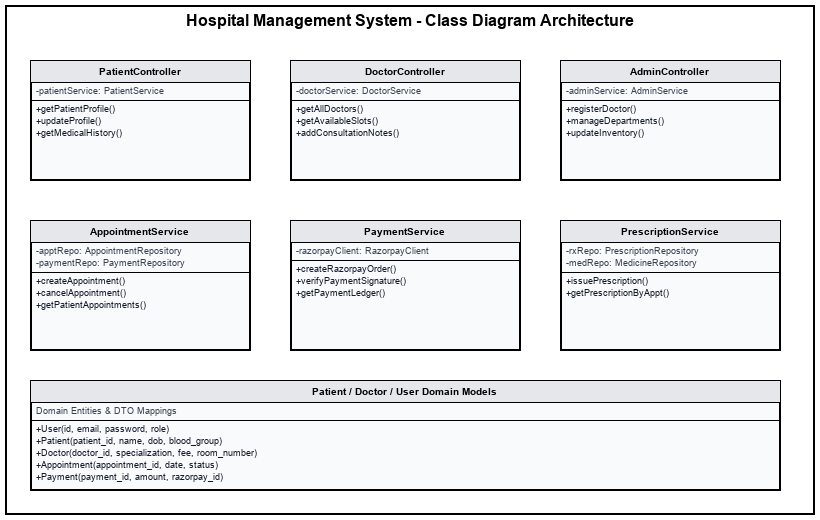
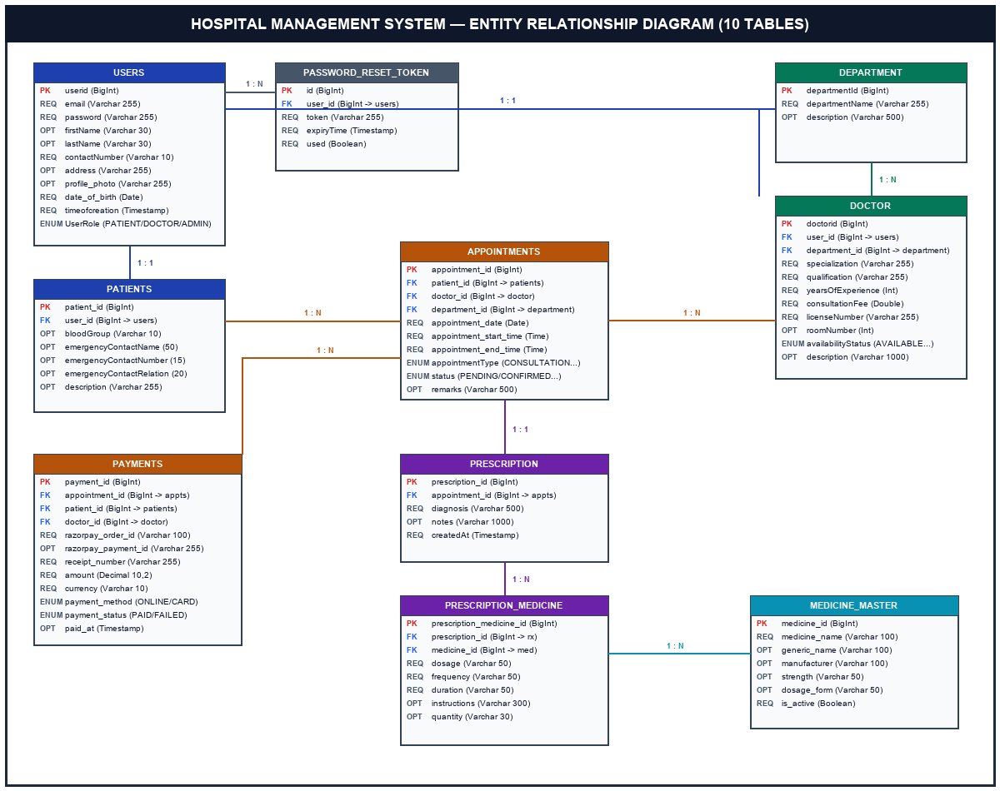

<h1 align="center">🏥 Hospital Management System (HMS)</h1>

<p align="center">
  <b>A modern, full-stack healthcare platform built to streamline clinical workflows, patient care, and hospital operations.</b>
</p>

<p align="center">
  <a href="https://medicare-hospital.duckdns.org" target="_blank" rel="noopener noreferrer">
    
  </a>
  
  
  
  
  
</p>

<p align="center">
  <a href="https://medicare-hospital.duckdns.org" target="_blank" rel="noopener noreferrer"><b>🚀 Launch Live Application</b></a>
  &nbsp;&nbsp;•&nbsp;&nbsp;
  <a href="USER_CREDENTIALS.md" target="_blank" rel="noopener noreferrer"><b>🔑 Test Credentials</b></a>
  &nbsp;&nbsp;•&nbsp;&nbsp;
  <a href="utkarshhsmreport.pdf" target="_blank" rel="noopener noreferrer"><b>📄 View System Report (PDF)</b></a>
  &nbsp;&nbsp;•&nbsp;&nbsp;
  <a href="#-interactive-documentation-center"><b>📖 Documentation Hub</b></a>
  &nbsp;&nbsp;•&nbsp;&nbsp;
  <a href="#-quick-start-guide"><b>⚡ Quick Start</b></a>
</p>

---

## 👋 Welcome to HMS

The **Hospital Management System (HMS)** is a complete healthcare ecosystem designed to eliminate paper-based administrative friction in medical facilities. It connects patients, medical practitioners, and hospital administrators under one unified, secure platform—making it effortless to search for specialists, book consultation slots in 30-minute intervals, process online payments, issue digital prescriptions, and track pharmacy stock in real time.

### 🌟 Key Features & Capabilities
- ⏱️ **30-Minute Slot Reservations**: Smart scheduling prevents double-bookings between 09:00 AM and 05:00 PM.
- 💳 **Online Payment Processing**: Seamless Razorpay gateway integration with signature verification and email receipts.
- 📋 **Digital Prescriptions**: Linked directly to patient consultation records, tracking diagnosis, dosage, and frequency.
- 💊 **Pharmacy Inventory Control**: Real-time medicine stock updates linked automatically to digital prescription issuance.
- 🔍 **Guest Doctor Discovery**: Allows visitors to search doctors by specialty, consultation fee, or room number without logging in.

---

## 🖼️ Application Screenshots & UI Preview

<details open>
<summary><b>✨ Click to expand Visual Application Screenshots</b></summary>

<br/>

### 1. Homepage & Quick Doctor Search


---

### 2. Patient Portal Dashboard


---

### 3. Administrator Control Panel


---

### 4. Authentication & User Registration
<p align="center">
  
  &nbsp;
  
</p>
</details>

---

## 📖 Interactive Documentation Center

<details>
<summary><b>📁 1. Project Directory & Architecture</b></summary>

HMS follows a clean, decoupled monorepo architecture featuring a **Spring Boot 3.x** backend service and a **React 18 SPA** frontend, orchestrated via Docker Compose:

```
Hospital-Management-System/
├── Back-hospital-management-system/          # Spring Boot 3.x Backend Service
│   ├── src/main/java/com/hospital/hospital_management_system/
│   │   ├── RestController/                    # REST API Controllers (Auth, Doctor, Appts, Payment)
│   │   ├── service/                           # Core Business Services & Integrations
│   │   ├── model/                             # JPA Entity Definitions (10 Core Tables)
│   │   ├── repository/                        # Spring Data JPA Repositories
│   │   ├── DTO/                               # Data Transfer Objects
│   │   ├── config/                            # Security, CORS, & Mail Configuration
│   │   ├── filter/                            # JWT Security Filters
│   │   ├── utils/                             # Token & Verification Utilities
│   │   └── Exceptions/                        # Custom Global Exception Handlers
│   ├── Dockerfile                             # Backend Dockerfile
│   └── pom.xml                                # Maven Dependencies
│
├── Front-hospital-management-system/          # React 18 SPA Frontend Service
│   └── hospital managment system/
│       ├── src/
│       │   ├── admin/                         # Admin Dashboard & Roster Views
│       │   ├── doctor/                        # Doctor Portal & Prescription Issuance
│       │   ├── patient/                       # Patient Portal, Doctor Search & Booking
│       │   ├── components/                    # Reusable UI Components & Modals
│       │   ├── config/                        # Axios Interceptors & Routes
│       │   ├── utils/                         # Token Management
│       │   ├── App.jsx                        # Main Application Gateway
│       │   └── main.jsx                       # React DOM Entrypoint
│       ├── Dockerfile                         # Frontend Dockerfile
│       ├── nginx.conf                         # Nginx Reverse Proxy Config
│       └── package.json                       # Dependencies & Scripts
│
├── docs_images/                               # Architecture Diagrams & Screenshots
├── docker-compose.yml                         # Container Orchestration
├── utkarshhsmreport.pdf                       # System Architectural PDF Report
└── README.md                                  # Repository Documentation
```
</details>

<details>
<summary><b>📐 2. Visual Architecture & Flow Diagrams</b></summary>

### Use Case Diagram


---

### Level-1 Data Flow Diagram (DFD)


---

### System Class Diagram Architecture


---

### Entity Relationship Diagram (10 Database Tables)

</details>

<details>
<summary><b>🗄️ 3. Relational Database Schema (10 Core Tables)</b></summary>

### 1. `users` Table — Account Identity Store
| Column Name | Data Type | Length | Allow Null | Constraint | Description |
| :--- | :--- | :--- | :---: | :--- | :--- |
| `userid` | BigInt | 20 | No | Primary Key | Unique user account ID |
| `email` | Varchar | 255 | No | Unique | Login email address |
| `password` | Varchar | 255 | No | None | BCrypt hashed password |
| `firstName` | Varchar | 30 | Yes | None | User first name |
| `lastName` | Varchar | 30 | Yes | None | User last name |
| `contactdetails` | Varchar | 10 | No | None | 10-digit mobile number |
| `address` | Varchar | 255 | Yes | None | Residential address |
| `profile_photo` | Varchar | 255 | Yes | None | Profile picture URL |
| `date_of_birth` | Date | - | No | None | Date of birth |
| `timeofcreation` | Timestamp | - | No | None | Creation timestamp |
| `UserRole` | Varchar | 50 | Yes | Enum | `PATIENT`, `DOCTOR`, `ADMIN` |

### 2. `patients` Table — Patient Metadata
| Column Name | Data Type | Length | Allow Null | Constraint | Description |
| :--- | :--- | :--- | :---: | :--- | :--- |
| `patient_id` | BigInt | 20 | No | Primary Key | Patient record ID |
| `user_id` | BigInt | 20 | No | FK (Unique) | Linked `users(userid)` |
| `blood_group` | Varchar | 10 | Yes | None | Blood group |
| `emergency_contact_name` | Varchar | 50 | Yes | None | Emergency contact name |
| `emergency_contact_number` | Varchar | 15 | Yes | None | Emergency contact phone |
| `emergency_contact_relation` | Varchar | 20 | Yes | None | Contact relationship |
| `description` | Varchar | 255 | Yes | None | Background notes |

### 3. `doctor` Table — Doctor Directory
| Column Name | Data Type | Length | Allow Null | Constraint | Description |
| :--- | :--- | :--- | :---: | :--- | :--- |
| `doctorid` | BigInt | 20 | No | Primary Key | Doctor record ID |
| `user_id` | BigInt | 20 | No | FK (Unique) | Linked `users(userid)` |
| `department_id` | BigInt | 20 | Yes | FK | Linked `department(departmentId)` |
| `specialization` | Varchar | 255 | No | None | Medical specialty |
| `qualification` | Varchar | 255 | No | None | Academic degrees |
| `yearsOfExperience` | Int | 11 | No | None | Years of clinical practice |
| `consultationFee` | Double | 10,2 | No | None | Consultation charge |
| `licenseNumber` | Varchar | 255 | No | Unique | Medical license number |
| `roomNumber` | Int | 11 | Yes | None | OPD room number |
| `availabilityStatus` | Varchar | 50 | Yes | Enum | `AVAILABLE`, `NOT_AVAILABLE`, `ON_LEAVE` |
| `description` | Varchar | 1000 | Yes | None | Bio summary |

### 4. `department` Table — Hospital Departments
| Column Name | Data Type | Length | Allow Null | Constraint | Description |
| :--- | :--- | :--- | :---: | :--- | :--- |
| `departmentId` | BigInt | 20 | No | Primary Key | Department ID |
| `departmentName` | Varchar | 255 | No | Unique | Department title |
| `description` | Varchar | 500 | Yes | None | Clinical services summary |

### 5. `appointments` Table — Booking Ledger
| Column Name | Data Type | Length | Allow Null | Constraint | Description |
| :--- | :--- | :--- | :---: | :--- | :--- |
| `appointment_id` | BigInt | 20 | No | Primary Key | Booking ID |
| `patient_id` | BigInt | 20 | No | FK | Linked `patients` |
| `doctor_id` | BigInt | 20 | No | FK | Linked `doctor` |
| `department_id` | BigInt | 20 | No | FK | Linked `department` |
| `appointment_date` | Date | - | No | None | Consultation date |
| `appointment_start_time` | Time | - | No | None | Slot start time (09:00 - 17:00) |
| `appointment_end_time` | Time | - | No | None | Slot end time |
| `appointmentType` | Varchar | 50 | No | Enum | Consultation type |
| `status` | Varchar | 50 | No | Enum | `PENDING`, `CONFIRMED`, `CANCELLED`, `COMPLETED` |
| `remarks` | Varchar | 500 | Yes | None | Additional notes |

### 6. `payments` Table — Transaction Audit Log
| Column Name | Data Type | Length | Allow Null | Constraint | Description |
| :--- | :--- | :--- | :---: | :--- | :--- |
| `payment_id` | BigInt | 20 | No | Primary Key | Payment transaction ID |
| `appointment_id` | BigInt | 20 | No | FK | Linked `appointments` |
| `patient_id` | BigInt | 20 | No | FK | Linked `patients` |
| `doctor_id` | BigInt | 20 | No | FK | Linked `doctor` |
| `razorpay_order_id` | Varchar | 100 | No | Unique | Gateway order ID |
| `razorpay_payment_id` | Varchar | 255 | Yes | Unique | Gateway payment ID |
| `razorpay_signature` | Varchar | 500 | Yes | None | HMAC SHA-256 signature |
| `receipt_number` | Varchar | 255 | No | Unique | Receipt reference |
| `amount` | Decimal | 10,2 | No | None | Transaction total amount |
| `currency` | Varchar | 10 | No | None | Currency identifier |
| `payment_method` | Varchar | 50 | Yes | Enum | Card, UPI, Netbanking |
| `order_status` | Varchar | 50 | Yes | Enum | Processing state |
| `payment_status` | Varchar | 50 | Yes | Enum | `PENDING`, `SUCCESS`, `FAILED` |
| `paid_at` | Timestamp | - | Yes | None | Payment success timestamp |
| `created_at` | Timestamp | - | Yes | None | Payment initiation timestamp |

### 7. `medicine_master` Table — Pharmacy Stock
| Column Name | Data Type | Length | Allow Null | Constraint | Description |
| :--- | :--- | :--- | :---: | :--- | :--- |
| `medicine_id` | BigInt | 20 | No | Primary Key | Medicine inventory ID |
| `medicine_name` | Varchar | 100 | No | None | Commercial name |
| `generic_name` | Varchar | 100 | Yes | None | Active ingredient |
| `manufacturer` | Varchar | 100 | Yes | None | Manufacturer |
| `strength` | Varchar | 50 | Yes | None | Dosage strength |
| `dosage_form` | Varchar | 50 | Yes | None | Tablet, Syrup, etc. |
| `is_active` | Boolean | 1 | No | None | Active stock flag |

### 8. `prescription` Table — Diagnostic Headers
| Column Name | Data Type | Length | Allow Null | Constraint | Description |
| :--- | :--- | :--- | :---: | :--- | :--- |
| `prescription_id` | BigInt | 20 | No | Primary Key | Digital prescription ID |
| `appointment_id` | BigInt | 20 | No | FK (Unique) | Linked `appointments` |
| `diagnosis` | Varchar | 500 | No | None | Clinical diagnosis notes |
| `notes` | Varchar | 1000 | Yes | None | Doctor advice and instructions |
| `createdAt` | Timestamp | - | Yes | None | Timestamp of creation |

### 9. `prescription_medicine` Table — Prescribed Line Items
| Column Name | Data Type | Length | Allow Null | Constraint | Description |
| :--- | :--- | :--- | :---: | :--- | :--- |
| `prescription_medicine_id` | BigInt | 20 | No | Primary Key | Record ID |
| `prescription_id` | BigInt | 20 | No | FK | Linked `prescription` |
| `medicine_id` | BigInt | 20 | No | FK | Linked `medicine_master` |
| `dosage` | Varchar | 50 | No | None | Unit dosage |
| `frequency` | Varchar | 50 | No | None | Intake frequency |
| `duration` | Varchar | 50 | No | None | Course duration |
| `instructions` | Varchar | 300 | Yes | None | Specific instructions |
| `quantity` | Varchar | 30 | Yes | None | Quantity dispensed |

### 10. `password_reset_token` Table — Security Tokens
| Column Name | Data Type | Length | Allow Null | Constraint | Description |
| :--- | :--- | :--- | :---: | :--- | :--- |
| `id` | BigInt | 20 | No | Primary Key | Token entry ID |
| `token` | Varchar | 255 | No | Unique | Secure UUID token |
| `user_id` | BigInt | 20 | Yes | FK | Linked `users(userid)` |
| `expiryTime` | Timestamp | - | No | None | Token expiration timestamp |
| `used` | Boolean | 1 | No | None | Token consumption status |
</details>

<details>
<summary><b>💻 4. Code Standards & Conventions</b></summary>

| Identifier Category | Casing Pattern | Example Implementation | Context & Rules |
| :--- | :--- | :--- | :--- |
| **Classes & Enums** | `PascalCase` | `Patient`, `DoctorService`, `AppointmentController` | Noun phrases representing domain concepts. No underscores. |
| **Service Methods** | `camelCase` | `getPatientById()`, `bookAppointment()`, `processPayment()` | Action-oriented verbs describing specific business operations. |
| **Method Parameters** | `camelCase` | `patientId`, `doctorDTO`, `appointmentDate` | Self-explanatory parameter names reflecting types and roles. |
| **Interfaces** | `PascalCase` | `PatientRepository`, `PaymentService` | Contracts for Spring Data JPA repositories and core services. |
| **Entity Properties** | `PascalCase` / `camelCase` | `ConsultationFee`, `appointmentDate` | Noun attributes mapped to database columns. |
| **Private Fields** | `_camelCase` | `_patientService`, `_doctorRepo` | Private dependency fields injected into service layers. |
| **Exceptions** | `PascalCase` + `Exception` | `ResourceNotFoundException`, `UnauthorizedAccessException` | Suffix mandatory for all custom exception handlers. |
</details>

<details>
<summary><b>🗓️ 5. Development Milestones & History</b></summary>

```
2026-04-12  ──  Project Kickoff & Requirements Planning
2026-04-25  ──  SRS Documentation & Scope Finalization
2026-06-10  ──  System Architecture & 10-Table Database Design Approval
2026-07-02  ──  Backend Core Infrastructure Setup (Spring Boot 3.x + MySQL 8.0)
2026-07-08  ──  JWT Authentication & User Account REST APIs
2026-07-14  ──  Doctor Discovery & 30-Minute Slot Scheduling Logic
2026-07-20  ──  React 18 Single Page Application Frontend
2026-07-26  ──  Admin Control Panel & Department Roster Management
2026-07-30  ──  Razorpay Payment Gateway & Transaction Email Receipts
2026-08-02  ──  Pharmacy Inventory Stock & Digital Prescription Module
2026-08-05  ──  Security Audit & Role-Based Access Control Checks
2026-08-07  ──  Pilot Trial & Staff Workflow Optimization
2026-08-09  ──  Query Index Optimization & Performance Tuning
2026-08-11  ──  Production Deployment on AWS EC2 & RDS
```
</details>

---

## 🛠️ Technology Stack

- **Frontend**: React 18 SPA (Vite), Vanilla CSS, Axios, Lucide React, Tabler Icons
- **Backend**: Java 21, Spring Boot 3.x, Spring Security (JWT), Spring Data JPA, Hibernate ORM
- **Database**: MySQL 8.0 / Amazon RDS
- **Integrations**: Razorpay Payment API Gateway, JavaMailSender (SMTP)
- **DevOps & Infrastructure**: Docker, Docker Compose, Nginx Reverse Proxy, AWS EC2, Let's Encrypt SSL, DuckDNS

---

## ⚡ Quick Start Guide

### Prerequisites
- [Java 17/21 JDK](https://www.oracle.com/java/technologies/downloads/)
- [Node.js 18+ and npm](https://nodejs.org/)
- [MySQL 8.0](https://dev.mysql.com/downloads/installer/)
- [Docker Desktop](https://www.docker.com/products/docker-desktop/) *(Optional)*

---

### Step 1: Clone Repository
```bash
git clone https://github.com/utkarshpawade1234/Hospital-Management-System.git
cd Hospital-Management-System
```

---

### Step 2: Set Environment Variables
Create a `.env` file in the root folder:

```env
# Database Configuration
DB_URL=jdbc:mysql://localhost:3306/hospital_management_system
DB_USERNAME=root
DB_PASSWORD=your_mysql_password

# Security & CORS
JWT_SECRET=your_super_secret_jwt_key_32_bytes_long!!
FRONTEND_URL=http://localhost:5173

# Email Service (SMTP)
MAIL_HOST=smtp.gmail.com
MAIL_PORT=587
MAIL_USERNAME=your-email@gmail.com
MAIL_PASSWORD=your-app-password

# Payment Gateway (Razorpay)
RAZORPAY_KEY_ID=your_razorpay_key_id
RAZORPAY_KEY_SECRET=your_razorpay_key_secret
```

---

### Step 3: Run with Docker (Recommended)
```bash
docker compose up -d --build
```
Access the application at `http://localhost`.

---

### Step 4: Run Manually

#### Launch Backend (Spring Boot):
```bash
./mvnw clean install
./mvnw spring-boot:run
```
*(Backend runs on `http://localhost:8080`)*

#### Launch Frontend (React SPA):
```bash
cd Front-hospital-management-system/"hospital managment system"
npm install
npm run dev
```
*(Frontend runs on `http://localhost:5173`)*

---

## 📄 License

Distributed under the MIT License. See `LICENSE` for details.
