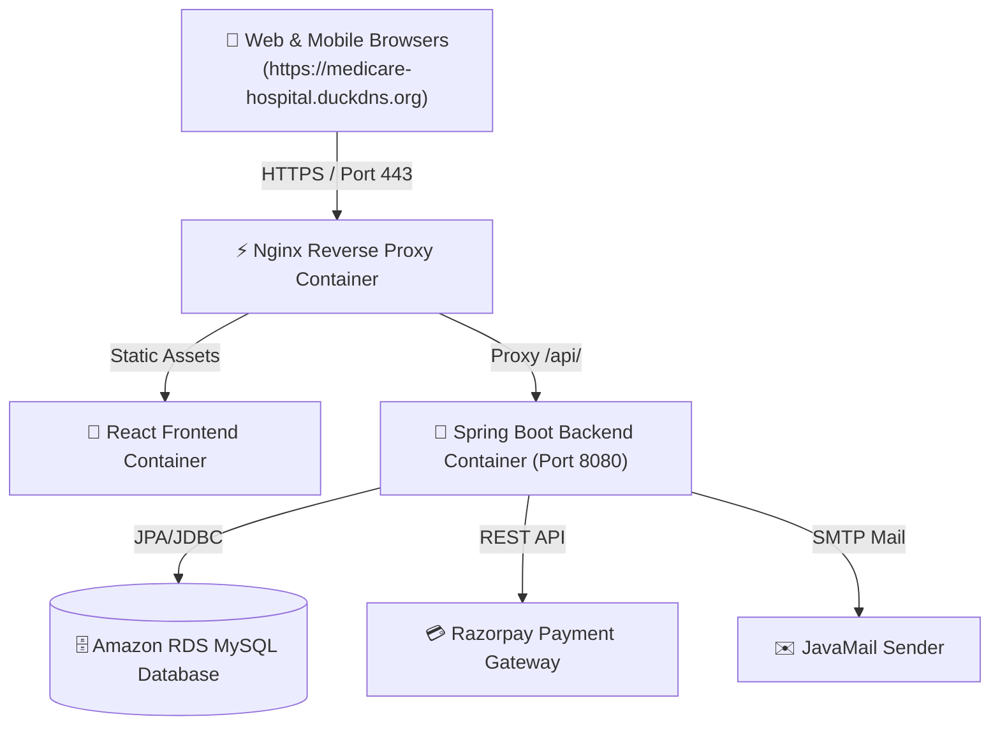

# 🏥 Medicare - Full-Stack Hospital Management System

[](https://spring.io/projects/spring-boot)
[](https://react.dev/)
[](https://www.docker.com/)
[](https://aws.amazon.com/)
[](https://letsencrypt.org/)

**Medicare** is a comprehensive, production-ready Full-Stack Hospital Management System designed to streamline patient appointments, doctor schedules, administrative operations, online payment verification, and automated email notifications.

🌐 **Live Demo**: [https://medicare-hospital.duckdns.org](https://medicare-hospital.duckdns.org)

---

## ✨ Features & Key Highlights

### 👨‍⚕️ Patient Portal
- **User Authentication**: Secure JWT-based registration and login system.
- **Appointment Booking**: Browse doctors by specialization, select available time slots, and book appointments.
- **Online Payment Integration**: Integrated with **Razorpay Payment Gateway** for instant appointment confirmation upon successful payment.
- **Real-Time Sorting**: Displays most recently booked appointments at the top of the patient dashboard.
- **Automated Email Notifications**: Real-time email confirmations sent to patients via JavaMailSender upon booking/payment updates.

### 🩺 Doctor & Admin Management
- **Doctor Schedules**: Manage availability slots, appointment approvals, and patient consult histories.
- **Admin Control Center**: Comprehensive dashboard to monitor system users, doctor registrations, and revenue analytics.

### 🛡️ Security & Performance
- **Custom Spring Security CORS**: Configured with explicit origin whitelisting (`setAllowedOrigins`) to prevent unauthorized cross-origin requests.
- **Nginx Reverse Proxy**: Single-origin architecture serving frontend static assets and proxying `/api/` calls seamlessly on Port 80 & Port 443.
- **HTTPS SSL Encryption**: Free automated SSL certificate via **Let's Encrypt / Certbot** with 301 HTTPS auto-redirects.

---

## 🛠️ Technology Stack

| Layer | Technologies Used |
| :--- | :--- |
| **Frontend** | React 18, Vite, Vanilla CSS, Axios, Lucide Icons, Tabler Icons |
| **Backend** | Java 21, Spring Boot 3, Spring Security, Spring Data JPA, Hibernate, JWT |
| **Database** | MySQL 8.0, Amazon RDS |
| **Payments & Mail** | Razorpay REST API, JavaMailSender (SMTP) |
| **DevOps & Cloud** | Docker, Docker Compose, Nginx, AWS EC2, Let's Encrypt (Certbot), DuckDNS |

---

## 🏗️ System Architecture



---

## 🚀 Getting Started Locally

### Prerequisites
- Java 21 JDK
- Node.js (v18+ or v20+)
- Docker & Docker Compose
- MySQL Server 8.0

### 1. Clone the Repository
```bash
git clone https://github.com/utkarshpawade1234/Hospital-Management-System.git
cd Hospital-Management-System
```

### 2. Configure Environment Variables
Create a `.env` file in the root directory (or configure application properties):

```env
DB_URL=jdbc:mysql://localhost:3306/hospital_management_system
DB_USERNAME=root
DB_PASSWORD=yourpassword

FRONTEND_URL=http://localhost:5173

MAIL_USERNAME=your-email@gmail.com
MAIL_PASSWORD=your-app-password

RAZORPAY_KEY_ID=rzp_test_your_key_id
RAZORPAY_KEY_SECRET=your_key_secret
```

### 3. Run using Docker Compose
```bash
docker compose up -d --build
```

Access the application locally at `http://localhost`.

---

## ☁️ Deployment Architecture (AWS EC2 + Docker)

The project is configured for automated containerized deployment on AWS EC2:

1. **Docker Compose Orchestration**: Both frontend (Nginx) and backend (Spring Boot) services are containerized and connected via an internal Docker bridge network.
2. **Reverse Proxying**: Nginx routes standard HTTP/HTTPS traffic to the Spring Boot backend container (`http://backend:8080/`), preventing CORS errors in production.
3. **Automated SSL**: Certbot manages SSL certificates automatically inside `/etc/letsencrypt`.

---

## 📄 License

Distributed under the MIT License. See `LICENSE` for more information.

---

## 👨‍💻 Author

**Utkarsh Pawade**  
- GitHub: [@utkarshpawade1234](https://github.com/utkarshpawade1234)  
- Live Project: [https://medicare-hospital.duckdns.org](https://medicare-hospital.duckdns.org)
