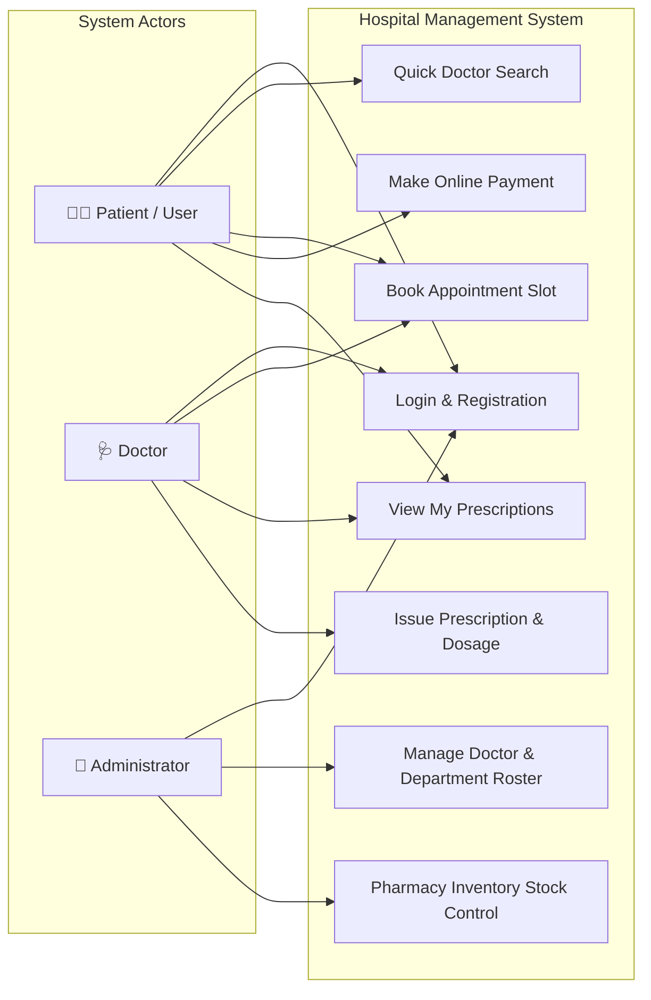
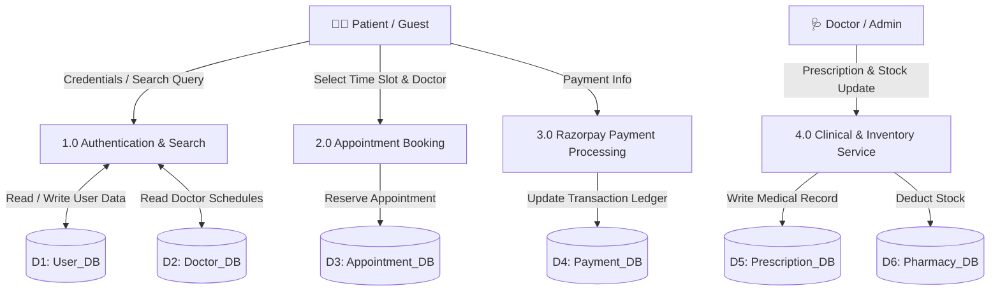

# 🏥 Hospital Management System (HMS) — Technical System Report

  <b>System Architecture & Engineering Documentation</b> 
  <i>Author: Utkarsh Pawade</i>

---

## 📌 1. Platform Overview

The **Hospital Management System (HMS)** is a modern, full-stack software application built to manage patient care, physician scheduling, consultation bookings, digital prescriptions, pharmacy inventory, and billing ledgers.

The system features a public **Quick Search** engine allowing visitors to browse medical specialists, clinical departments, consultation fees, and operational hours. Registered patients can log in to book 30-minute consultation slots, complete online fee payments, access digital prescriptions, and view medical history logs.

### Key Features
- **Department & Doctor Search**: Query doctors across Cardiology, Neurology, Pediatrics, Orthopedics, Dermatology, Gynecology, ENT, Ophthalmology, and General Medicine.
- **30-Minute Slot Reservations**: Book consultation time slots in 30-minute intervals between 09:00 AM and 05:00 PM with real-time double-booking prevention.
- **Automated Payment Processing**: Verification of consultation fees via integrated Razorpay REST APIs with HMAC signature validation and automated email confirmation receipts.
- **Digital Health Ledger**: Centralized history tracking past and upcoming consultation records, medical diagnoses, prescribed dosages, and pharmacy dispensation.

---

## ⚙️ 2. System Specifications & SLAs

### 2.1 Functional Scope
- **User Roles**: Supports Guest Visitors, Registered Patients, Doctors, and System Administrators.
- **Registration & Profiles**: Secure user registration collecting profile details (Name, Contact Number, Email, DOB, Gender, Blood Group, Address, Emergency Contacts, Profile Photo).
- **Doctor Discovery**: Query capabilities against the doctor directory filtered by department, doctor name, or specialization.
- **Slot Reservation & Concurrency Guard**: Transactional validation checking slot availability before processing checkout.
- **Digital Prescriptions**: Medical practitioners assign digital prescriptions attached to consultation IDs, capturing diagnosis, notes, dosage, frequency, duration, and instructions.
- **Pharmacy Stock Management**: Real-time stock updates linked directly to prescription issuance.

### 2.2 Performance & Technical SLAs
- **High Capacity**: Optimized to handle **≥ 1,000 requests per second** via Spring Boot 3.x stateless REST services and Hibernate ORM level-2 caching.
- **Sub-200ms Latency**: Query execution times under 200 milliseconds across all REST endpoints.
- **Data Consistency**: Strict ACID compliance across multi-table transactional workflows (Booking ➔ Payment Gateway ➔ Pharmacy Stock Update).

---

## 🗄️ 3. Database Design (10 Core Tables)

The database schema consists of 10 normalized MySQL 8.0 tables enforcing strict foreign key constraints:

### 1. `users` Table
| Column Name | Data Type | Length | Allow Null | Constraint | Description |
| :--- | :--- | :--- | :---: | :--- | :--- |
| `userid` | BigInt | 20 | No | Primary Key | Unique user identity |
| `email` | Varchar | 255 | No | Unique | Login email address |
| `password` | Varchar | 255 | No | None | BCrypt hashed password |
| `firstName` | Varchar | 30 | Yes | None | User first name |
| `lastName` | Varchar | 30 | Yes | None | User last name |
| `contactdetails` | Varchar | 10 | No | None | 10-digit mobile number |
| `address` | Varchar | 255 | Yes | None | Residential address |
| `profile_photo` | Varchar | 255 | Yes | None | Profile picture URL |
| `date_of_birth` | Date | - | No | None | Date of birth |
| `timeofcreation` | Timestamp | - | No | None | Creation timestamp |
| `UserRole` | Varchar | 50 | Yes | Enum | `PATIENT`, `DOCTOR`, `ADMIN` |

### 2. `patients` Table
| Column Name | Data Type | Length | Allow Null | Constraint | Description |
| :--- | :--- | :--- | :---: | :--- | :--- |
| `patient_id` | BigInt | 20 | No | Primary Key | Patient record ID |
| `user_id` | BigInt | 20 | No | FK (Unique) | Linked `users(userid)` |
| `blood_group` | Varchar | 10 | Yes | None | Blood group |
| `emergency_contact_name` | Varchar | 50 | Yes | None | Emergency contact person |
| `emergency_contact_number` | Varchar | 15 | Yes | None | Emergency contact phone |
| `emergency_contact_relation` | Varchar | 20 | Yes | None | Relation to patient |
| `description` | Varchar | 255 | Yes | None | Medical background notes |

### 3. `doctor` Table
| Column Name | Data Type | Length | Allow Null | Constraint | Description |
| :--- | :--- | :--- | :---: | :--- | :--- |
| `doctorid` | BigInt | 20 | No | Primary Key | Doctor record ID |
| `user_id` | BigInt | 20 | No | FK (Unique) | Linked `users(userid)` |
| `department_id` | BigInt | 20 | Yes | FK | Linked `department(departmentId)` |
| `specialization` | Varchar | 255 | No | None | Medical specialty |
| `qualification` | Varchar | 255 | No | None | Academic degrees |
| `yearsOfExperience` | Int | 11 | No | None | Years of clinical practice |
| `consultationFee` | Double | 10,2 | No | None | Consultation charge |
| `licenseNumber` | Varchar | 255 | No | Unique | Medical license number |
| `roomNumber` | Int | 11 | Yes | None | Consultation room number |
| `availabilityStatus` | Varchar | 50 | Yes | Enum | `AVAILABLE`, `NOT_AVAILABLE`, `ON_LEAVE` |
| `description` | Varchar | 1000 | Yes | None | Doctor bio summary |

### 4. `department` Table
| Column Name | Data Type | Length | Allow Null | Constraint | Description |
| :--- | :--- | :--- | :---: | :--- | :--- |
| `departmentId` | BigInt | 20 | No | Primary Key | Department ID |
| `departmentName` | Varchar | 255 | No | Unique | Department title |
| `description` | Varchar | 500 | Yes | None | Department overview |

### 5. `appointments` Table
| Column Name | Data Type | Length | Allow Null | Constraint | Description |
| :--- | :--- | :--- | :---: | :--- | :--- |
| `appointment_id` | BigInt | 20 | No | Primary Key | Consultation booking ID |
| `patient_id` | BigInt | 20 | No | FK | Linked `patients(patient_id)` |
| `doctor_id` | BigInt | 20 | No | FK | Linked `doctor(doctorid)` |
| `department_id` | BigInt | 20 | No | FK | Linked `department(departmentId)` |
| `appointment_date` | Date | - | No | None | Consultation date |
| `appointment_start_time` | Time | - | No | None | Slot start time (09:00 - 17:00) |
| `appointment_end_time` | Time | - | No | None | Slot end time |
| `appointmentType` | Varchar | 50 | No | Enum | Consultation type |
| `status` | Varchar | 50 | No | Enum | `PENDING`, `CONFIRMED`, `CANCELLED`, `COMPLETED` |
| `remarks` | Varchar | 500 | Yes | None | Additional notes |

### 6. `payments` Table
| Column Name | Data Type | Length | Allow Null | Constraint | Description |
| :--- | :--- | :--- | :---: | :--- | :--- |
| `payment_id` | BigInt | 20 | No | Primary Key | Payment transaction ID |
| `appointment_id` | BigInt | 20 | No | FK | Linked `appointments` |
| `patient_id` | BigInt | 20 | No | FK | Linked `patients` |
| `doctor_id` | BigInt | 20 | No | FK | Linked `doctor` |
| `razorpay_order_id` | Varchar | 100 | No | Unique | Gateway order ID |
| `razorpay_payment_id` | Varchar | 255 | Yes | Unique | Gateway payment transaction ID |
| `razorpay_signature` | Varchar | 500 | Yes | None | HMAC SHA-256 signature |
| `receipt_number` | Varchar | 255 | No | Unique | Generated receipt code |
| `amount` | Decimal | 10,2 | No | None | Total transaction amount |
| `currency` | Varchar | 10 | No | None | Currency identifier |
| `payment_method` | Varchar | 50 | Yes | Enum | Card, UPI, Netbanking |
| `order_status` | Varchar | 50 | Yes | Enum | Processing state |
| `payment_status` | Varchar | 50 | Yes | Enum | `PENDING`, `SUCCESS`, `FAILED` |
| `paid_at` | Timestamp | - | Yes | None | Payment success timestamp |
| `created_at` | Timestamp | - | Yes | None | Payment initiation timestamp |

### 7. `medicine_master` Table
| Column Name | Data Type | Length | Allow Null | Constraint | Description |
| :--- | :--- | :--- | :---: | :--- | :--- |
| `medicine_id` | BigInt | 20 | No | Primary Key | Inventory medicine ID |
| `medicine_name` | Varchar | 100 | No | None | Commercial trade name |
| `generic_name` | Varchar | 100 | Yes | None | Active ingredient |
| `manufacturer` | Varchar | 100 | Yes | None | Manufacturer |
| `strength` | Varchar | 50 | Yes | None | Dosage strength |
| `dosage_form` | Varchar | 50 | Yes | None | Tablet, Capsule, Syrup |
| `is_active` | Boolean | 1 | No | None | Stock active status |

### 8. `prescription` Table
| Column Name | Data Type | Length | Allow Null | Constraint | Description |
| :--- | :--- | :--- | :---: | :--- | :--- |
| `prescription_id` | BigInt | 20 | No | Primary Key | Digital prescription ID |
| `appointment_id` | BigInt | 20 | No | FK (Unique) | Linked `appointments` |
| `diagnosis` | Varchar | 500 | No | None | Diagnosis notes |
| `notes` | Varchar | 1000 | Yes | None | Doctor advice and instructions |
| `createdAt` | Timestamp | - | Yes | None | Timestamp of creation |

### 9. `prescription_medicine` Table
| Column Name | Data Type | Length | Allow Null | Constraint | Description |
| :--- | :--- | :--- | :---: | :--- | :--- |
| `prescription_medicine_id` | BigInt | 20 | No | Primary Key | Line item record ID |
| `prescription_id` | BigInt | 20 | No | FK | Linked `prescription` |
| `medicine_id` | BigInt | 20 | No | FK | Linked `medicine_master` |
| `dosage` | Varchar | 50 | No | None | Unit dosage |
| `frequency` | Varchar | 50 | No | None | Intake frequency |
| `duration` | Varchar | 50 | No | None | Course duration |
| `instructions` | Varchar | 300 | Yes | None | Specific instructions |
| `quantity` | Varchar | 30 | Yes | None | Total quantity dispensed |

### 10. `password_reset_token` Table
| Column Name | Data Type | Length | Allow Null | Constraint | Description |
| :--- | :--- | :--- | :---: | :--- | :--- |
| `id` | BigInt | 20 | No | Primary Key | Token entry ID |
| `token` | Varchar | 255 | No | Unique | Secure UUID token |
| `user_id` | BigInt | 20 | Yes | FK | Linked `users(userid)` |
| `expiryTime` | Timestamp | - | No | None | Token expiration timestamp |
| `used` | Boolean | 1 | No | None | Consumption status flag |

---

## 💻 4. Code Standards & Architecture

### Coding Conventions
- **Class / Enum Names**: `PascalCase` representing domain entities (e.g., `Patient`, `DoctorService`, `AppointmentController`).
- **Method Names**: `camelCase` verb phrases describing actions (e.g., `getPatientById()`, `bookAppointment()`, `processPayment()`).
- **Method Parameters**: `camelCase` self-descriptive parameter identifiers (e.g., `patientId`, `doctorDTO`).
- **Interface Definitions**: `PascalCase` contracts for Spring Data JPA repositories (e.g., `PatientRepository`, `PaymentService`).
- **Private Dependency Injections**: `_camelCase` naming pattern for injected private fields (e.g., `_patientService`, `_doctorRepo`).
- **Custom Exceptions**: `PascalCase` + `Exception` suffix (e.g., `ResourceNotFoundException`, `UnauthorizedAccessException`).

---

## 📐 5. System Diagrams

### 5.1 Use Case Diagram

### 5.2 Data Flow Diagram (DFD Level 1)

